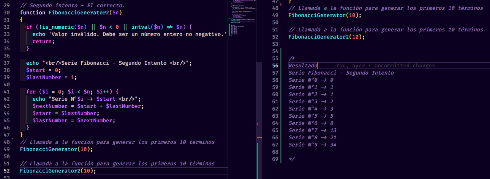
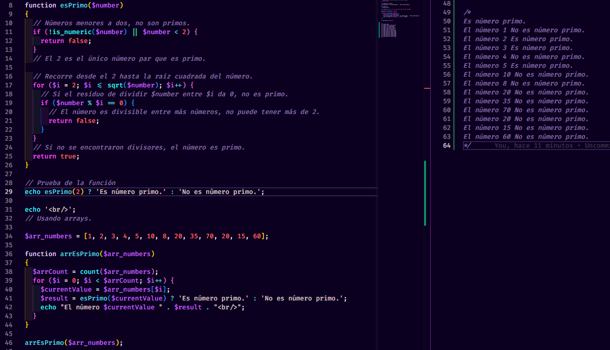
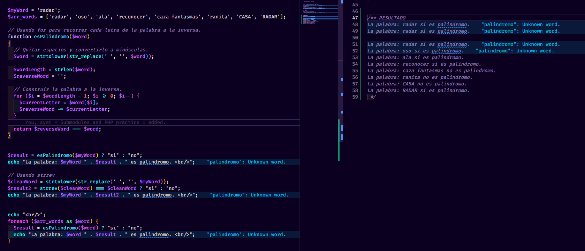
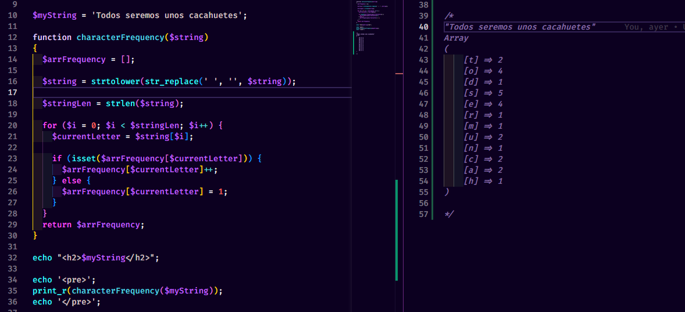

## Ejercicios de Lógica con Estructuras de Control y Funciones en PHP

Tarea asignada en el módulo 4 en Kodigo Academy.

---

***Resuelve los siguientes problemas utilizando estructuras de control y funciones en PHP. Asegúrate de proporcionar comentarios en tu código para explicar la lógica detrás de cada paso.***

Adicionalmente se hizo la prueba usando la misma función desarrollada y agregando ejemplos en un arreglo para recorrerlos todos.
 

### Problema de la serie Fibonacci:

Escribe una función llamada generar Fibonacci que reciba un número n como parámetro y genere los primeros n términos de la serie Fibonacci. La serie comienza con 0 y 1, y cada término subsiguiente es la suma de los dos anteriores.

### Problema de números Primos:

Crea una función llamada esPrimo que determine si un número dado es primo o no. Un número primo es aquel que solo es divisible por 1 y por sí mismo.

### Problema de Palíndromos:

Implementa una función llamada esPalindromo que determine si una cadena de texto dada es un palíndromo. Un palíndromo es una palabra, frase o secuencia que se lee igual en ambas direcciones.

### Problema de Frecuencia de Caracteres:
Implementa una función que tome una cadena de texto y devuelva un array asociativo que muestre la frecuencia de cada carácter en la cadena.

