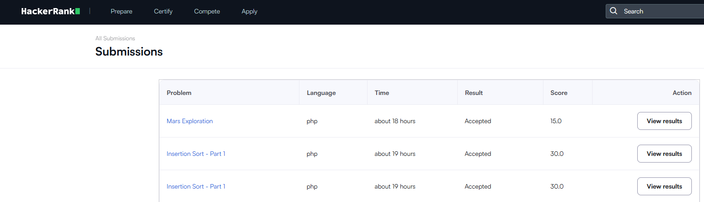
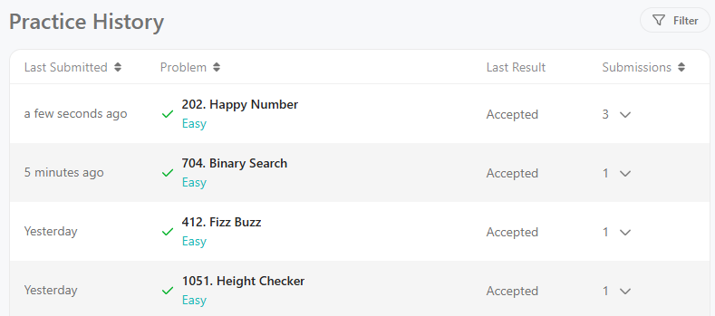

# Logic Exercises

***
Complete all the exercises in the following link:
https://everlasting-espadrille-281.notion.site/Logic-Exercises-13a8641bc68180e5955df98eb9d50684
***

---

***Perform the following logic exercises using what you have seen in class:***

- *Using PHP*
- *Sorting algorithms (if necessary)*
- *Search algorithms (if needed)*

### Exercises:
---
1st day: Exercises from 01 - 05 - Individual

---

2nd day: Exercises from 06 - 10 - Group
(08 - Mars Exploration)

https://github.com/Chriss-267/Ejercicios-2-php